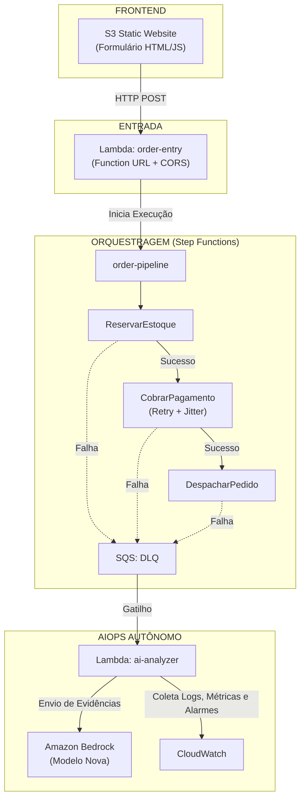
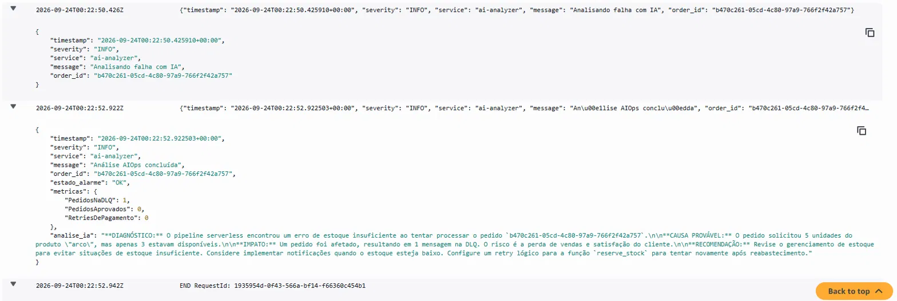

# Projeto Final — Sistema de Pedidos Serverless Event-Driven com AIOps

Arquitetura serverless completa na AWS, consolidando todos os checkpoints do curso em uma solução ponta a ponta: frontend estático, pipeline de eventos, orquestração, observabilidade e inteligência artificial para análise autônoma de falhas (AIOps).

---

## Provedor Utilizado

* **AWS** (Lambda, Step Functions, SQS, S3, CloudWatch, X-Ray, Bedrock)
* **GitHub Actions** (CI/CD)

---

## Arquitetura do Sistema



> **Observabilidade Transversal:** CloudWatch Logs, Métricas customizadas, CloudWatch Alarms e X-Ray Traces ativos em todas as camadas.  
> **CI/CD:** GitHub Actions com deploy automático de Lambdas e Frontend a cada `push`.

---

## Estrutura do Repositório

```text
projeto-final/
 ├── .github/
 │   └── workflows/
 │       └── deploy.yml              # Pipeline de CI/CD (GitHub Actions)
 ├── frontend/
 │   └── index.html                  # Interface estática hospedada no S3
 ├── functions/
 │   ├── order_entry.py              # Ponto de entrada HTTP pública
 │   ├── reserve_stock.py            # Passo 1: Reserva de estoque
 │   ├── charge_payment.py           # Passo 2: Processamento de pagamento
 │   ├── ship_order.py               # Passo 3: Despacho do pedido
 │   ├── ai_analyzer.py              # AIOps acionado pela DLQ via Bedrock
 │   └── requirements.txt            # Dependências Python
 ├── terraform/                      # Infraestrutura como Código (IaC)
 ├── workflow/
 │   └── order_pipeline.asl.json     # Definição do Step Functions (ASL)
 └── README.md                       # Documentação principal
```

---

## Decisões Técnicas

| Componente / Decisão | Justificativa Técnica |
| :--- | :--- |
| **Lambda + Function URL** | Modelo serverless com escala a zero, eliminando custos fixos e reduzindo complexidade sem API Gateway. |
| **Step Functions** | Orquestração declarativa visual, retries nativos configuráveis e tratamento de exceções integrado. |
| **SQS DLQ** | Retenção assíncrona de falhas não recuperáveis para evitar perda de dados e acionar a análise de AIOps. |
| **Jitter no Retry** | Distribuição estocástica das retentativas no tempo, prevenindo cenários de *thundering herd*. |
| **S3 Static Website** | Hospedagem resiliente do frontend sem gerenciamento de servidores e custo próximo de zero. |
| **CloudWatch + X-Ray** | Telemetria nativa distribuída (logs, métricas, alarmes e traces) sem overhead de agentes externos. |
| **Amazon Bedrock (Nova)** | Execução de LLM totalmente gerenciada com autenticação via IAM nativa pelo SDK `boto3`. |
| **Terraform** | Provisionamento reprodutível e versionado da infraestrutura com remote state isolado via S3/DynamoDB. |
| **GitHub Actions** | Automação de CI/CD para build, testes e deploy em ambiente limpo, padronizando os deploys. |

---

## Como Rodar do Zero

### Pré-requisitos

* **AWS CLI** configurado (`aws configure`)
* **Terraform >= 1.5**
* Bucket S3 e tabela DynamoDB para o remote state do Terraform previamente criados

### Deploy da infraestrutura

```bash
cd terraform
terraform init
terraform apply
```

Após o apply, adicione a `api_url` do output como secret no GitHub:

| Secret | Valor |
|---|---|
| `API_URL` | valor do output `api_url` |

A partir daí, qualquer push em `functions/` ou `frontend/` dispara
o deploy completo automaticamente — incluindo a substituição da URL
no frontend e o upload para o S3.

---

### Configurar CI/CD (GitHub Actions)

1. Crie um usuário IAM dedicado (`github-actions-deploy`) com permissões estritas para `lambda:UpdateFunctionCode` e `s3:PutObject`.
2. Adicione os seguintes segredos em **Settings $\rightarrow$ Secrets and variables $\rightarrow$ Actions** no repositório GitHub:
   * `AWS_ACCESS_KEY_ID`
   * `AWS_SECRET_ACCESS_KEY`
   * `AWS_REGION`
3. Qualquer `push` realizado na pasta `functions/` ou `frontend/` disparará o deploy automatizado.

---

## Como Testar

* **Caminho Feliz:** Acesse a URL estática do S3 no navegador, preencha nome, produto e quantidade válidos (ex: `espada`, quantidade `2`) e clique em **Fazer Pedido**.
* **Forçar Falha (Acionamento de AIOps):** Selecione o produto `Arco` e defina a quantidade `99` (estoque insuficiente). O pedido falhará, será direcionado à DLQ e acionará a Lambda `ai-analyzer`. A função coletará os registros e métricas recentes do CloudWatch e submeterá ao Amazon Bedrock.
* **Verificar a Análise da IA:**
  * Acesse **CloudWatch** $\rightarrow$ **Log groups** $\rightarrow$ `/aws/lambda/order-pipeline-final-ai-analyzer`
  * Abra o log stream mais recente e inspecione o objeto JSON no campo `"analise_ia"`.

---

## Evidências

### AIOps — Análise de Falha Gerada pelo Amazon Bedrock



O registro do log demonstra a execução do fluxo AIOps: coleta automática de evidências operacionais do CloudWatch (logs estruturados, métricas e estado de alarmes), submissão dos dados ao Amazon Bedrock e retorno da análise detalhada com diagnóstico, causa provável, extensão do impacto e recomendações técnicas em linguagem natural (português).

---

## Segurança

* A Function URL pública não está exposta no controle de versão.
* Nenhuma chave de acesso, credencial estática ou ARN sensível está mantida no repositório.
* Princípio do Menor Privilégio aplicado em todas as roles do IAM.
* O arquivo de estado do Terraform (`terraform.tfstate`) permanece criptografado no S3.
* Chaves do pipeline de CI/CD protegidas em ambiente seguro via GitHub Secrets.
* Isolação de rede: Apenas a função de entrada (`order-entry`) e o site no S3 possuem acesso público; as funções internas (`reserve-stock`, `charge-payment`, `ship-order`, `ai-analyzer`) operam sem endpoints HTTP expostos.